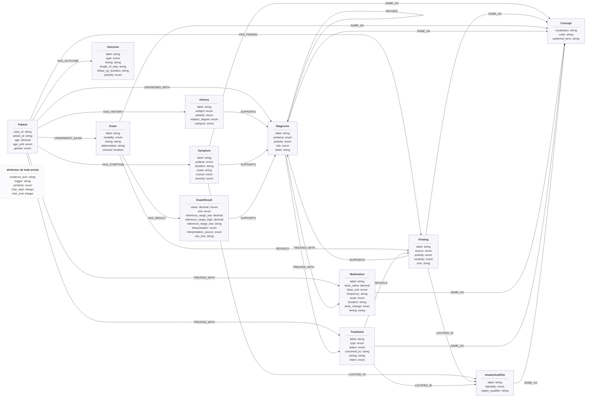

```mermaid
%%{init: {"flowchart": {"wrappingWidth": 400, "nodeSpacing": 70, "rankSpacing": 120}}}%%
flowchart LR
    Patient["<b>Patient</b><hr>case_id: string<br>article_id: string<br>age: decimal<br>age_unit: enum<br>gender: enum"]
    History["<b>History</b><hr>label: string<br>subject: enum<br>polarity: enum<br>relation_degree: enum<br>category: enum"]
    Symptom["<b>Symptom</b><hr>label: string<br>polarity: enum<br>duration: string<br>onset: string<br>course: enum<br>severity: enum"]
    Exam["<b>Exam</b><hr>label: string<br>modality: enum<br>timing: string<br>abbreviation: string<br>contrast: boolean"]
    ExamResult["<b>ExamResult</b><hr>value: decimal | enum<br>unit: enum<br>reference_range_low: decimal<br>reference_range_high: decimal<br>reference_range_raw: string<br>interpretation: enum<br>interpretation_source: enum<br>raw_text: string"]
    Finding["<b>Finding</b><hr>label: string<br>source: enum<br>polarity: enum<br>certainty: enum<br>size: string"]
    Diagnosis["<b>Diagnosis</b><hr>label: string<br>certainty: enum<br>polarity: enum<br>role: enum<br>basis: string"]
    Treatment["<b>Treatment</b><hr>label: string<br>type: enum<br>status: enum<br>converted_to: string<br>timing: string<br>intent: enum"]
    Medication["<b>Medication</b><hr>label: string<br>dose_value: decimal<br>dose_unit: enum<br>frequency: string<br>route: enum<br>duration: string<br>dose_change: enum<br>timing: string"]
    Outcome["<b>Outcome</b><hr>label: string<br>type: enum<br>timing: string<br>length_of_stay: string<br>follow_up_duration: string<br>polarity: enum"]
    Site["<b>AnatomicalSite</b><hr>label: string<br>laterality: enum<br>region_qualifier: string"]
    Concept["<b>Concept</b><hr>vocabulary: string<br>code: string<br>preferred_term: string"]

    Patient -- "HAS_HISTORY" --> History
    Patient -- "HAS_SYMPTOM" --> Symptom
    Patient -- "UNDERWENT_EXAM" --> Exam
    Patient -- "HAS_FINDING" --> Finding
    Patient -- "DIAGNOSED_WITH" --> Diagnosis
    Patient -- "TREATED_WITH" --> Treatment
    Patient -- "TREATED_WITH" --> Medication
    Patient -- "HAS_OUTCOME" --> Outcome
    Exam -- "HAS_RESULT" --> ExamResult
    Exam -- "REVEALS" --> Finding
    Treatment -- "REVEALS" --> Finding
    History -- "SUPPORTS" --> Diagnosis
    Symptom -- "SUPPORTS" --> Diagnosis
    Finding -- "SUPPORTS" --> Diagnosis
    ExamResult -- "SUPPORTS" --> Diagnosis
    Diagnosis -- "TREATED_WITH" --> Treatment
    Diagnosis -- "TREATED_WITH" --> Medication
    Diagnosis -- "REVISES" --> Diagnosis
    Symptom -- "LOCATED_IN" --> Site
    Finding -- "LOCATED_IN" --> Site
    Treatment -- "LOCATED_IN" --> Site

    Symptom -- "SAME_AS" --> Concept
    Finding -- "SAME_AS" --> Concept
    Exam -- "SAME_AS" --> Concept
    Diagnosis -- "SAME_AS" --> Concept
    Medication -- "SAME_AS" --> Concept
    Treatment -- "SAME_AS" --> Concept
    Site -- "SAME_AS" --> Concept

    EdgeAttrs["<b>attributes de toda aresta</b><hr>evidence_text: string<br>trigger: string<br>certainty: enum<br>char_start: integer<br>char_end: integer"]

    classDef t fill:#f7f7fb,stroke:#8a8ac0
    class Patient,History,Symptom,Exam,ExamResult,Finding,Diagnosis,Treatment,Medication,Outcome,Site,Concept t
    classDef legend fill:#fbfbfd,stroke:#b0b0b8,stroke-dasharray:4 3
    class EdgeAttrs legend
```
