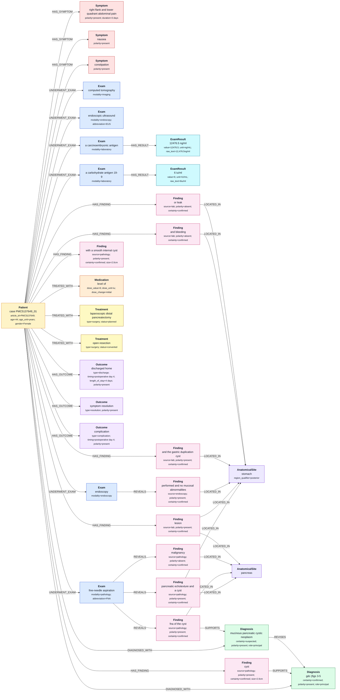

# Grafo do caso PMC5137649_01

- Nós: 32
- Arestas: 42

```mermaid
flowchart LR
  classDef Patient fill:#fef3c7,stroke:#d97706,color:#111827
  classDef History fill:#e0e7ff,stroke:#4338ca,color:#111827
  classDef Symptom fill:#fee2e2,stroke:#b91c1c,color:#111827
  classDef Finding fill:#fce7f3,stroke:#be185d,color:#111827
  classDef Exam fill:#dbeafe,stroke:#1d4ed8,color:#111827
  classDef ExamResult fill:#cffafe,stroke:#0e7490,color:#111827
  classDef Diagnosis fill:#dcfce7,stroke:#15803d,color:#111827
  classDef Treatment fill:#fef9c3,stroke:#a16207,color:#111827
  classDef Medication fill:#ffedd5,stroke:#c2410c,color:#111827
  classDef AnatomicalSite fill:#ede9fe,stroke:#6d28d9,color:#111827
  classDef Outcome fill:#f3e8ff,stroke:#7e22ce,color:#111827
  classDef Concept fill:#f3f4f6,stroke:#4b5563,color:#111827

  P1["<b>Patient</b><br/>case PMC5137649_01<br/><small>article_id=PMC5137649; age=44; age_unit=years; gender=Female</small>"]:::Patient
  S1["<b>Symptom</b><br/>right flank and lower quadrant abdominal pain<br/><small>polarity=present; duration=3 days</small>"]:::Symptom
  S2["<b>Symptom</b><br/>nausea<br/><small>polarity=present</small>"]:::Symptom
  S3["<b>Symptom</b><br/>constipation<br/><small>polarity=present</small>"]:::Symptom
  E1["<b>Exam</b><br/>computed tomography<br/><small>modality=imaging</small>"]:::Exam
  E2["<b>Exam</b><br/>endoscopic ultrasound<br/><small>modality=endoscopy; abbreviation=EUS</small>"]:::Exam
  E3["<b>Exam</b><br/>fine-needle aspiration<br/><small>modality=pathology; abbreviation=FNA</small>"]:::Exam
  E4["<b>Exam</b><br/>endoscopy<br/><small>modality=endoscopy</small>"]:::Exam
  E5["<b>Exam</b><br/>a carcinoembryonic antigen<br/><small>modality=laboratory</small>"]:::Exam
  R1["<b>ExamResult</b><br/>12476.5 ng/ml<br/><small>value=12476.5; unit=ng/mL; raw_text=12,476.5ng/ml</small>"]:::ExamResult
  E6["<b>Exam</b><br/>a carbohydrate antigen 19-9<br/><small>modality=laboratory</small>"]:::Exam
  R2["<b>ExamResult</b><br/>6 iu/ml<br/><small>value=6; unit=IU/mL; raw_text=6iu/ml</small>"]:::ExamResult
  A1["<b>AnatomicalSite</b><br/>stomach<br/><small>region_qualifier=posterior</small>"]:::AnatomicalSite
  A2["<b>AnatomicalSite</b><br/>pancreas"]:::AnatomicalSite
  F1["<b>Finding</b><br/>pancreatic echotexture and a cyst<br/><small>source=pathology; polarity=present; certainty=confirmed</small>"]:::Finding
  F2["<b>Finding</b><br/>fna of the cyst<br/><small>source=pathology; polarity=present; certainty=confirmed</small>"]:::Finding
  F3["<b>Finding</b><br/>malignancy<br/><small>source=pathology; polarity=absent; certainty=confirmed</small>"]:::Finding
  F4["<b>Finding</b><br/>lesion<br/><small>source=lab; polarity=present; certainty=confirmed</small>"]:::Finding
  F5["<b>Finding</b><br/>performed and no mucosal abnormalities<br/><small>source=endoscopy; polarity=present; certainty=confirmed</small>"]:::Finding
  F6["<b>Finding</b><br/>and the gastric duplication cyst<br/><small>source=lab; polarity=present; certainty=confirmed</small>"]:::Finding
  F7["<b>Finding</b><br/>and bleeding<br/><small>source=lab; polarity=absent; certainty=confirmed</small>"]:::Finding
  F8["<b>Finding</b><br/>or leak<br/><small>source=lab; polarity=absent; certainty=confirmed</small>"]:::Finding
  F9["<b>Finding</b><br/>cyst<br/><small>source=pathology; polarity=present; certainty=confirmed; size=2.0cm</small>"]:::Finding
  F10["<b>Finding</b><br/>with a smooth internal cyst<br/><small>source=pathology; polarity=present; certainty=confirmed; size=2.0cm</small>"]:::Finding
  D1["<b>Diagnosis</b><br/>mucinous pancreatic cystic neoplasm<br/><small>certainty=suspected; polarity=present; role=principal</small>"]:::Diagnosis
  D2["<b>Diagnosis</b><br/>gdc (figs 3-5<br/><small>certainty=confirmed; polarity=present; role=principal</small>"]:::Diagnosis
  M1["<b>Medication</b><br/>level of<br/><small>dose_value=6; dose_unit=iu; dose_change=initial</small>"]:::Medication
  T1["<b>Treatment</b><br/>laparoscopic distal pancreatectomy<br/><small>type=surgery; status=planned</small>"]:::Treatment
  T2["<b>Treatment</b><br/>open resection<br/><small>type=surgery; status=converted</small>"]:::Treatment
  O1["<b>Outcome</b><br/>discharged home<br/><small>type=discharge; timing=postoperative day 4; length_of_stay=4 days; polarity=present</small>"]:::Outcome
  O2["<b>Outcome</b><br/>symptom resolution<br/><small>type=resolution; polarity=present</small>"]:::Outcome
  O3["<b>Outcome</b><br/>complication<br/><small>type=complication; timing=postoperative day 4; polarity=present</small>"]:::Outcome

  P1 -->|HAS_SYMPTOM| S1
  P1 -->|HAS_SYMPTOM| S2
  P1 -->|HAS_SYMPTOM| S3
  P1 -->|DIAGNOSED_WITH| D1
  P1 -->|DIAGNOSED_WITH| D2
  P1 -->|HAS_OUTCOME| O1
  P1 -->|HAS_OUTCOME| O3
  P1 -->|HAS_OUTCOME| O2
  E5 -->|HAS_RESULT| R1
  E6 -->|HAS_RESULT| R2
  P1 -->|UNDERWENT_EXAM| E1
  P1 -->|UNDERWENT_EXAM| E2
  P1 -->|UNDERWENT_EXAM| E3
  P1 -->|UNDERWENT_EXAM| E4
  P1 -->|UNDERWENT_EXAM| E5
  P1 -->|UNDERWENT_EXAM| E6
  E3 -->|REVEALS| F1
  F1 -->|LOCATED_IN| A1
  F1 -->|LOCATED_IN| A2
  E3 -->|REVEALS| F2
  F2 -->|LOCATED_IN| A2
  E3 -->|REVEALS| F3
  F3 -->|LOCATED_IN| A2
  P1 -->|HAS_FINDING| F4
  F4 -->|LOCATED_IN| A1
  F4 -->|LOCATED_IN| A2
  E4 -->|REVEALS| F5
  F5 -->|LOCATED_IN| A1
  P1 -->|HAS_FINDING| F6
  F6 -->|LOCATED_IN| A1
  P1 -->|HAS_FINDING| F7
  F7 -->|LOCATED_IN| A1
  P1 -->|HAS_FINDING| F8
  F8 -->|LOCATED_IN| A1
  P1 -->|HAS_FINDING| F9
  P1 -->|HAS_FINDING| F10
  P1 -->|TREATED_WITH| T1
  P1 -->|TREATED_WITH| T2
  P1 -->|TREATED_WITH| M1
  F2 -->|SUPPORTS| D1
  F9 -->|SUPPORTS| D2
  D1 -->|REVISES| D2
```
