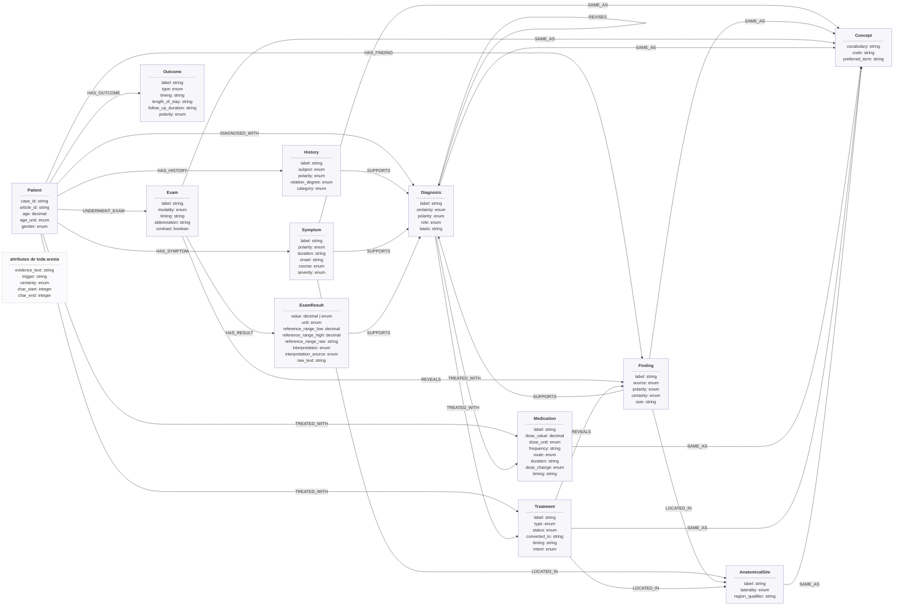

# Projeto `Grafo de Conhecimento de Casos Clínicos do MultiCaRe`

## Slides

[Apresentação do Projeto 1 (PDF)](assets/slides/CGGJL.pdf)

## Metodologia

O projeto converte o `case_text` de cada caso clínico da amostra do MultiCaRe (56 casos de 50 artigos) em um grafo representado por duas tabelas: nós (`case_id`, `node_id`, `type`, `label`, `attributes`) e arestas (`case_id`, `edge_id`, `source_id`, `target_id`, `relation`, `attributes`). Nenhum modelo de linguagem participa da extração: só regras, expressões regulares, léxicos e dicionários.

O trabalho foi feito em duas fases:

1. **Contrato comum.** Primeiro definimos o que extrair e como representar. O resultado são 11 entidades e 12 relações, cada uma com domínio de valores e exemplo tirado da amostra ([`docs/01-dados-a-extrair.md`](docs/01-dados-a-extrair.md)). Também definimos o esquema do grafo ([`docs/02-esquema-grafo.md`](docs/02-esquema-grafo.md)). A regra geral é extrair apenas trechos identificáveis no texto, sem inferir nada por conhecimento clínico.
2. **Uma estratégia clássica por parser.** Cada integrante implementou um parser independente, `case_id` → nós + arestas, que aprofunda uma técnica e mede o impacto dela sobre o grafo final:

| Estratégia | Responsável | Issue | Pergunta investigada | Código | Documentação |
|---|---|---|---|---|---|
| Tokenização | Gabriel Lorhan Rodrigues Dourado | [#3](https://github.com/caiomelloni/PNL-CGGJL/issues/3) | Onde ficam as fronteiras dos tokens em texto clínico, como `12,476.5ng/ml`? | [`src/tokenizacao`](src/tokenizacao/) | [`docs/tokenizacao.md`](docs/tokenizacao.md) |
| Normalização | George Henrique de Lima Sá | [#4](https://github.com/caiomelloni/PNL-CGGJL/issues/4) | Como fazer menções diferentes convergirem para o mesmo `label`? | [`src/normalizacao`](src/normalizacao/) | [`docs/normalizacao.md`](docs/normalizacao.md) |
| Remoção de stop-words | João Vitor Gonçalves Oliveira | [#5](https://github.com/caiomelloni/PNL-CGGJL/issues/5) | A remoção deve ser feita? Se sim, onde e com qual lista? | [`src/stopwords`](src/stopwords/) | [`docs/stopwords.md`](docs/stopwords.md) |
| Dicionários e ontologias | Lucas Guarnieri | [#6](https://github.com/caiomelloni/PNL-CGGJL/issues/6) | Como ligar menções a conceitos com código estável (MeSH)? | [`src/dicionarios`](src/dicionarios/) | [`docs/dicionarios.md`](docs/dicionarios.md) |
| POS tagging e sintagmas | Caio Melloni | [#9](https://github.com/caiomelloni/PNL-CGGJL/issues/9) | Como a sintaxe separa candidatos a nó (sintagmas nominais) de candidatos a aresta (verbos)? | [`src/sintagmas`](src/sintagmas/) | [`src/sintagmas/README.md`](src/sintagmas/README.md) |

Em todos os parsers, toda aresta guarda o trecho do texto que a sustenta, o gatilho léxico e os offsets. Isso permite auditar cada relação no texto original:

~~~python
case_text[char_start:char_end] == evidence_text
~~~

**Tokenização.** Um tokenizador de regex clínico com grupos nomeados, em ordem do mais específico para o mais geral, foi comparado com a separação por espaços e com o Treebank do NLTK. O extrator é o mesmo nos três casos, de modo que qualquer diferença no grafo se deve só à fronteira dos tokens:

~~~text
FIGURE_REF → NUM_HYPHEN_WORD → NUMBER_RANGE → NUMBER → UNIT → OPERATOR → WORD → PUNCTUATION
12,476.5ng/ml  →  [12,476.5 NUMBER] [ng/ml UNIT]  →  ExamResult(value=12476.5, unit=ng/mL)
~~~

**Normalização.** Os rótulos passam por NFKC, compactação de espaços, remoção da pontuação das bordas e *case folding*, com restauração da grafia canônica de termos sensíveis (`CA 19-9`, `HER2`, `IgG`). Siglas definidas no padrão `termo por extenso (SIGLA)` valem apenas dentro do caso. Unidades são canonizadas por dicionário (`ng/ml` → `ng/mL`, `per microliter` → `/µL`).

**Stop-words.** O mesmo extrator roda em 4 condições, todas comparadas contra o mesmo baseline, com 3 listas (NLTK, spaCy e uma customizada), nos 56 casos. Comparamos as tabelas geradas, não os tokens removidos. A remoção nunca apaga texto — substitui a palavra por espaços do mesmo tamanho, o que preserva os offsets:

- `BASELINE`: nenhuma remoção. `case_text` e `label` vão para os extratores sem alteração; é a referência contra a qual as outras 3 condições são comparadas.
- `NAIVE_UNPROTECTED`: a lista de stop-words é aplicada direto no `case_text`, antes da extração, sem nenhuma proteção — palavras de negação/certeza (`no`, `without`, `never`, ...) são mascaradas como qualquer outra, se estiverem na lista escolhida.
- `GUARDED_GLOBAL`: mesma aplicação no `case_text` antes da extração, mas com uma lista de proteção de 17 palavras de negação/certeza que nunca é mascarada, qualquer que seja a lista escolhida.
- `GUARDED_LABEL`: a extração roda sobre o texto original, como no baseline; a remoção age só depois, limpando o `label` já extraído — sem nunca esvaziá-lo por completo.

**Dicionários.** Um NER por gatilho léxico (`presented with`, `diagnosed with`, `underwent`) delimita as menções. Cada menção é casada contra o gazetteer em três níveis, e o casamento gera um nó `Concept` e uma aresta `SAME_AS`:

~~~python
exact → longest (janela multi-palavra) → fuzzy (rapidfuzz, threshold 85, MIN_FUZZY_LENGTH = 5)
~~~

**Sintagmas.** Um HMM bigrama de 12 etiquetas, treinado no Penn Treebank e decodificado por Viterbi, faz o POS tagging. Restrições são fixadas antes da decodificação (unidade, sigla, pontuação) e regras de reparo corrigem a sequência. Os sintagmas nominais `NP := DET? (NUM UNIT?)? MOD* NOUN+` são tipados pelo léxico e exportados em IOB2 no formato CoNLL.

## Trabalhos Estudados

- **MultiCaRe** (Nievas Offidani et al., 2025): descreve o dataset de origem. Deixa claro que os `mesh_terms` indexam o artigo, e não o caso. Por isso usamos esses termos só como sinal na validação cruzada do parser de dicionários, nunca como gabarito.
- **Survey de grafos de conhecimento** (Ji et al., 2022): base para separar entidades, relações e atributos. Motivou a decisão de guardar evidência e certeza na aresta, em vez de tratar a relação como fato absoluto.
- **Vocabulários controlados.** Comparamos MeSH, UMLS, SNOMED CT, LOINC, ICD-10 e RxNorm quanto a cobertura e licença ([`docs/dicionarios.md` §2](docs/dicionarios.md)). O MeSH foi adotado por ser de domínio público, cobrir doenças, drogas, exames e tratamentos e já aparecer no `metadata.csv`. RxNorm e SNOMED CT ficam como extensão natural.
- **Terminologia anatômica** (SEER/NCI e SUNY/Lumen Learning): material de partida para o gazetteer próprio de `AnatomicalSite`, com cerca de 50 conceitos curados à mão.
- **Tokenizador Treebank e listas de stop-words do NLTK e do spaCy**: usados como baselines clássicos contra os quais as estratégias do projeto foram medidas.

## Modelo Lógico

Grafo de propriedades com 11 tipos de entidade clínica mais o nó `Concept` de vocabulário controlado. Os domínios de cada atributo estão em [`docs/01-dados-a-extrair.md`](docs/01-dados-a-extrair.md).

## Análises que podem ser realizadas

- **Casos por conceito, não por grafia.** Com `SAME_AS`, `T2DM` em um caso e `type 2 diabetes mellitus` em outro apontam para o mesmo código MeSH (`D003924`). Isso permite agrupar e contar casos por doença, fármaco ou exame.
- **Consulta por região do corpo.** `LOCATED_IN` atravessa as categorias clínicas: todos os sintomas, achados e tratamentos ligados ao `pancreas`, independentemente do diagnóstico.
- **Cadeia de raciocínio clínico.** O caminho `Symptom | Finding | ExamResult | History -SUPPORTS-> Diagnosis` mostra qual evidência sustentou qual conclusão. `REVISES` mostra hipóteses substituídas, como a neoplasia mucinosa revista para cisto de duplicação gástrica em `PMC5137649_01`.
- **Negação e incerteza como dado.** `polarity=absent` e `certainty` permitem separar, por exemplo, casos com recorrência afirmada dos casos com *"no recurrence"*, ou diagnósticos confirmados dos apenas sugeridos.
- **Resultados fora da faixa.** `ExamResult` com `value`, `unit` canônica e faixa de referência permite listar resultados alterados e comparar valores entre casos na mesma unidade.
- **Trajetória terapêutica.** `dose_change` e `status` reconstroem mudanças de dose ao longo do caso e intervenções planejadas que não se concretizaram.
- **Auditoria da extração.** `evidence_text` e os offsets permitem medir precisão e revocação contra uma anotação humana quando ela existir.

## Ferramentas

| Ferramenta | Uso no projeto |
|---|---|
| Python 3.10+ (`re`, `csv`, `decimal`, `unicodedata`, `xml.etree`) | Base de todos os parsers; regras e regex usam só a biblioteca padrão |
| NLTK | `TreebankWordTokenizer` como baseline de tokenização; `word_tokenize` no parser de dicionários; lista de stop-words; corpus Penn Treebank para treinar o HMM de POS, que roda depois sem NLTK |
| spaCy | Apenas a lista `STOP_WORDS`, copiada e versionada; nenhum modelo spaCy é carregado |
| rapidfuzz | `fuzz.ratio` no casamento aproximado contra o gazetteer |
| MeSH 2026 (NLM) | Vocabulário controlado; gazetteer derivado com 174.006 termos em 5 categorias |
| Mermaid | Esquema do grafo e visualização do grafo de cada caso nos slides |
| `unittest` | Suítes automatizadas (151 testes na normalização, 14 na tokenização) |

As instruções de instalação e execução de cada parser estão no `README.md` da respectiva pasta em [`src/`](src/). A amostra (`sample/`) não é versionada.

## Resultados

**Tokenização: a fronteira do token decide se o resultado de exame existe.** Nos 56 casos, com o mesmo extrator:

| Tokenizador | Casos difíceis corretos | Nós | Arestas | `ExamResult` |
|---|---:|---:|---:|---:|
| Espaços | 5/9 | 297 | 288 | 0 |
| Treebank (NLTK) | 5/9 | 629 | 696 | 235 |
| Regex clínico | **9/9** | **755** | **929** | **330** |

Esses números medem rendimento estrutural, não precisão: sem anotação humana não é possível dizer quantos desses nós estão corretos.

**Stop-words: remover antes da extração destrói o grafo.** A tabela a seguir mostra os resultados agregados para a estratégia de stop-words.

| Condição | Lista | Nós perdidos | Nós ganhos | `polarity_changed` | Arestas perdidas | Arestas ganhas | Pior caso | Flips no pior caso |
|---|---|---:|---:|---:|---:|---:|---|---:|
| `GUARDED_GLOBAL` | `custom_clinical` | 641 | 389 | 0 | 664 | 463 | `PMC5137649_01` | 0 |
| `GUARDED_GLOBAL` | `nltk_stopwords` | 638 | 387 | 0 | 662 | 462 | `PMC5137649_01` | 0 |
| `GUARDED_GLOBAL` | `spacy_stopwords` | 640 | 388 | 0 | 663 | 462 | `PMC5137649_01` | 0 |
| `GUARDED_LABEL` | `custom_clinical` | 494 | 492 | 0 | 539 | 537 | `PMC5137649_01` | 0 |
| `GUARDED_LABEL` | `nltk_stopwords` | 486 | 485 | 0 | 536 | 536 | `PMC5137649_01` | 0 |
| `GUARDED_LABEL` | `spacy_stopwords` | 492 | 490 | 0 | 538 | 536 | `PMC5137649_01` | 0 |
| `NAIVE_UNPROTECTED` | `custom_clinical` | 641 | 389 | 0 | 664 | 463 | `PMC5137649_01` | 0 |
| `NAIVE_UNPROTECTED` | `nltk_stopwords` | 649 | 398 | **14** | 672 | 472 | `PMC12832199_01` | 3 |
| `NAIVE_UNPROTECTED` | `spacy_stopwords` | 651 | 399 | **21** | 675 | 474 | `PMC12832199_01` | 3 |

(gerado por `python3 project1/src/stopwords/run_experiment.py`; arquivo completo em
[`experiment_output/summary.csv`](../src/stopwords/experiment_output/summary.csv).)

Desses resultados, nota-se que NAIVE_UNPROTECTED sem aplicar proteção gera inversão de polaridade, 14 nós com nltk e 21 nós com spacy, devido a diferenças no conjunto de palavras. Já o NAIVE_UNPROTECTED com lista custom_clinical apresenta os mesmos resultados que GUARDED_GLOBAL com lista custom_clinical, pois com lista customizada a proteção se torna redundante. No geral apesar dos casos de GUARDED_GLOBAL e até mesmo NAIVE_UNPROTECTED com lista customizada não apresentarem inversão de polaridade, destaca-se aqui a diferença entre nós/arestas perdidos e nós/arestas ganhos, que ocorre pois termos como `with`, `of` e `to` ficam fora da proteção e eles são importantes como gatilhos de entidades em frases, definindo uma relação no grafo. Enfim, ao analisar GUARDED_LABEL vemos que esses valores são muito mais próximos entre eles, isso porque a aplicação do stop-words aqui ocorre direto na label, portanto um nó removido deveria ter um equivalente sem o stop-word adicionado novamente. E entre os três casos de testes, o de melhor resultado foi usando nltk em que as arestas são equivalentes e teve um nó perdido, que na verdade foi uma deduplicação.

**Dicionários: quase metade das entidades ligáveis ganhou código.** 139 de 288 (48,3%) geraram `SAME_AS`, com 135 nós `Concept`. Na validação cruzada com os `mesh_terms` do artigo, `Diagnosis`, `Treatment` e `Exam` têm sobreposição de 8–17%, e `Symptom` e `History` ficam em 0%, o que confirma que o MeSH do artigo indexa o tema, não cada sintoma. Ao construir o gazetteer anatômico, encontramos um falso positivo sistemático do fuzzy match em chaves curtas (`"had"` ≈ `"head"`, 85,7), corrigido com um comprimento mínimo de 5 caracteres.

**Normalização.** Em `PMC5137649_01`, 40 menções geraram 33 chaves brutas e 32 nós finais: 7 rótulos mudaram e 1 par de nós foi fundido. A inspeção revelou erros que continuam em aberto, como negação não capturada em *"no mucosal abnormalities"* e a medida `9.5cm x 4.5cm x 2.0cm` reduzida a `2.0cm`.

**Sintagmas: o gargalo é o léxico, não a sintaxe.** Dos 7.480 sintagmas identificados, só 1.049 (14%) foram tipados. O erro mais frequente é de fronteira certa com tipo errado: `heart rate` virou `AnatomicalSite`. Só 38 de 1.062 blocos engoliram o verbo, como em *"The colonoscopy showed extensive colitis"*, onde `showed` foi lido como particípio modificador.

**Limitações comuns.** Nenhum parser resolve correferência (`the cyst` mencionado cinco vezes gera cinco menções). Relações baseadas em proximidade na sentença podem ligar o resultado ao exame errado. Nenhum número acima é precisão clínica, porque não há gabarito anotado.

## Como Modelos de Linguagem foram Usados

Modelos de linguagem **não** foram usados na extração de entidades, relações ou atributos, conforme a restrição do enunciado: todos os parsers são baseados em regras, regex, léxicos e dicionários.

Eles foram usados como assistentes de programação e de documentação. O histórico do repositório registra commits coautorados por Claude (Sonnet 5 e Opus 5).

## Referências Bibliográficas

- Nievas Offidani, M., Roffet, F., González Galtier, M. C., Massiris, M., & Delrieux, C. (2025). An Open-Source Clinical Case Dataset for Medical Image Classification and Multimodal AI Applications. *Data*, 10(8), 123. https://doi.org/10.3390/DATA10080123
- Ji, S., Pan, S., Cambria, E., Marttinen, P., & Yu, P. S. (2022). A Survey on Knowledge Graphs: Representation, Acquisition, and Applications. *IEEE Transactions on Neural Networks and Learning Systems*, 33(2), 494–514. https://doi.org/10.1109/TNNLS.2021.3070843
- National Library of Medicine. *MeSH XML Data Files*. https://www.nlm.nih.gov/mesh/xmlmesh.html. Este projeto usa dados do MeSH (Medical Subject Headings), National Library of Medicine, EUA.
- National Library of Medicine. *Terms and Conditions for MeSH*. https://www.nlm.nih.gov/databases/download/terms_and_conditions_mesh.html
- National Cancer Institute. *SEER Training Modules — Anatomical Terminology*. https://training.seer.cancer.gov/anatomy/body/terminology.html
- SUNY / Lumen Learning. *Anatomy & Physiology I — Anatomical Terminology*. https://courses.lumenlearning.com/suny-ap1/chapter/anatomical-terminology/
- Bird, S., Klein, E., & Loper, E. (2009). *Natural Language Processing with Python*. O'Reilly. NLTK: https://www.nltk.org
- Explosion. spaCy — lista `STOP_WORDS` do inglês. https://github.com/explosion/spaCy
- Santanchè, A. *nlp2learn — Projeto 1 (2026)*. https://github.com/santanche/nlp2learn/tree/main/projects/2026/project1
